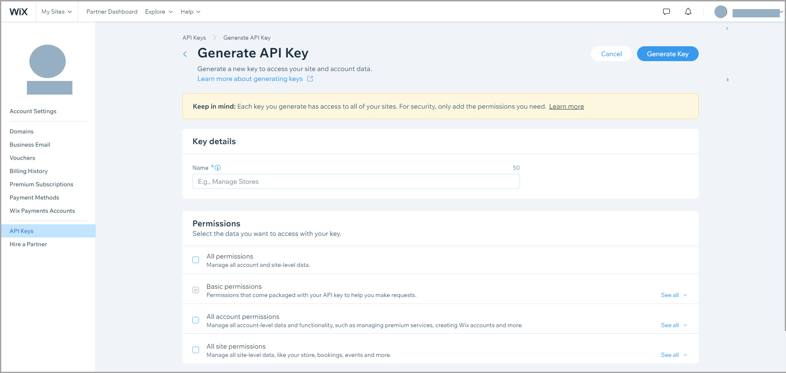

# About Account Level APIs

Wix's account level APIs enable developers to access and manage account level functionality, including domains, transferring sites between accounts, and inviting team members.

Accounts are particularly useful when a business employs multiple staff members who all should have access to and permissions to manage one or more sites created for the business, and when a design company creates and designs sites for clients. In these cases, creating a team and sharing account access with the relevant users allows them access to account-level (domains, payment and billing info, etc.) and site-level data. This allows the right people to edit the relevant sites and other account assets to get their work done and keep sites and businesses running smoothly.  

Account owners can use roles to limit team members’ access to various tasks and/or interfaces of the account (for example, blocking access to specific sites or blocking access to adding features that require payment). See [Managing Your Team](https://support.wix.com/en/article/wix-studio-managing-your-team) and [Wix Partners: Default Team Management Roles & Permissions](https://support.wix.com/en/article/default-team-management-roles-permissions#roles-and-permissions-summary-table) for more information.

## Intended audience
Wix’s Account Level APIs are intended to support the following types of customers:

- **Channel Partners**: Wix works with 2 types of Channel partners:
  - **Do it yourself (DIY)**: Businesses that resell Wix subscriptions, funneling customers directly into Wix’s site creation flow, to build a site for themselves with unique reseller attributes. These businesses don’t require edit access to the customer’s sites.
  - **Do it for me (DIFM)**: Businesses that create, manage, and maintain Wix sites in large numbers for their customers.
- **Enterprise Partners**: Large businesses and organizations that need advanced features and support to build and maintain their websites. 

## Authorization strategies for account level APIs
The APIs in this category require using the [admin access with API key strategy](https://dev.wix.com/docs/sdk/articles/get-started/authorization-strategies#admin-access-with-api-key).    

To learn how to implement this strategy for headless projects and apps, see [Create a Client with an API Key](https://dev.wix.com/docs/go-headless/coding/java-script-sdk/admin/create-a-client-with-an-api-key).  

To learn how to implement this strategy for channel and enterprise partners , see the ApiKeyStrategy in [About the Wix Client](https://dev.wix.com/docs/sdk/articles/work-with-the-sdk/about-the-wix-client).  

### About API keys
API keys are authentication tools that account owners and co-owners can create, enabling them and any developers they share the key with to make API calls at the account and site levels. 

If you are an account owner or co-owner, you can create and manage [API keys](https://support.wix.com/en/article/about-wix-api-keys) in the [API Keys Manager](https://manage.wix.com/account/api-keys), where you can assign a set of permissions that determine the types of APIs the key can access.

## Terminology
- **Account**: A collection of Wix assets, such as sites, domains, and premium plans, managed by one or more Wix users.
- **API key**: An account level authentication key, passed in the authorization header of API calls.
- **Role**: A defined type of access that an identity has on a specific site or account. Wix provides several predefined roles, such as co-owner, website manager, and website designer. Account owners and co-owners can also define custom roles.
- **Team member**: A Wix user that has been added to an account, with access to one or more sites and other assets. A single Wix user can be a team member in multiple accounts.
