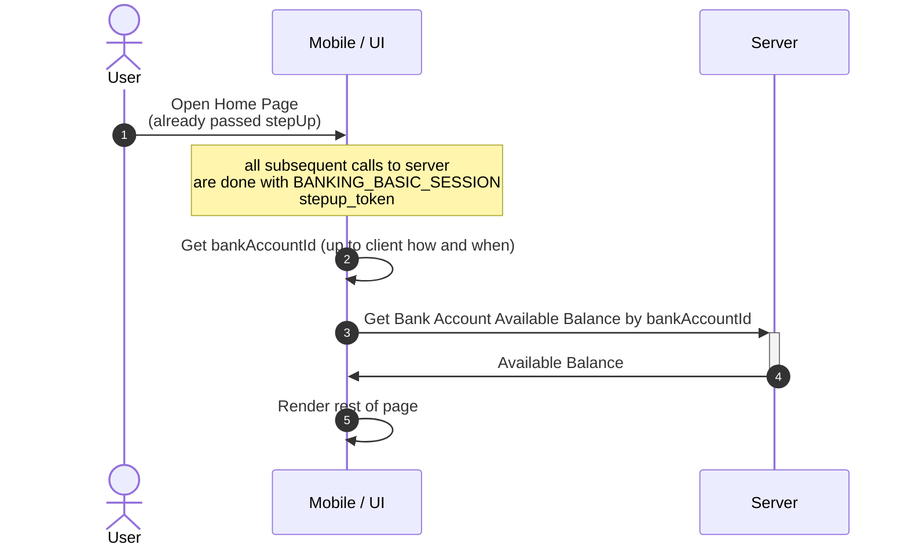

SortOrder: 1
## Use Cases

- [**Get Available balance**](#get-available-balance)

## Get Available balance
It is up to the client decide when to show balances.
Usually cases are
- fetch and show balances on UI when user enters wix checking zone
- period fetch and update balances on UI, so user always sees the latest balances
- show available balance on UI when user initiates transfer

