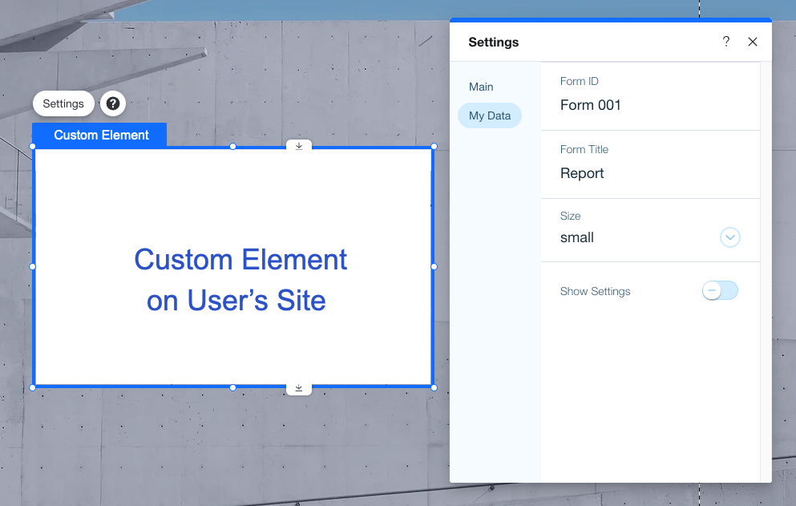

# About the Editor Deep Link API

This API generates a URL that will open the editor and add an app's [Custom Element](https://support.wix.com/en/article/wix-editor-adding-a-custom-element-to-your-site) component to the user's page. If the app doesn't have a Custom Element component, the URL just opens the editor.

> **Note:** This API works only with the [legacy custom element](https://dev.wix.com/docs/build-apps/develop-your-app/frameworks/self-hosting/supported-extensions/deprecated/legacy-custom-elements/legacy-custom-element-deprecated).

## Terminology

- **Custom Element** - A website component that contains a custom script as well as custom parameters with UI control elements in a settings panel.

- **Editor Deep Link** - A link that sends a user to the editor, adding a Custom Element components directly to the page.

## Use Cases

The Editor Deep Link API generates a URL that opens the editor and adds Custom Element components to a page. It can be used in the following ways.

### Use Case 1: Open the Editor

Calling the API for an app that doesn't have a Custom Element component generates a URL that just opens the editor. It isn't necessary to include any parameters in the body of the request.

#### Request

```CURL
Curl -X  POST \
https://www.wixapis.com/apps/v1/post-installation/editor-deep-link \
-H 'Authorization: <AUTH>'
```

#### Response
```
{
   "url": <url>
}
```

### Use Case 2: Use the Deep Link to Add a Custom Element

Add a Custom Element component to your app. Edit the component, and enter the URL for your script in the **Basic Info** section. Click the **Settings Panel** tab and add custom parameters to the settings panel, adding keys and values for each parameter. Values depend on the type of parameter - default text, toggle on/off, slider value and so on.


Use the API to create a URL that will open the user's editor and then add the Custom Element component to a page.

You can further customize each generated URL by adjusting the values of the custom parameters. This is done passing new values in the body of the request.

#### Request

```CURL
Curl -X  POST \
https://wixapis.com/apps/v1/post-installation/editor-deep-link \
-H 'Authorization: <AUTH>'

-data-raw '{
  "customParams": [
    {
      "key1": "value1",
      "key2": "value2"
    }
  ]
}'
```

#### Response

```JSON
{
   "url": <url>
}
```

> **Note:**
> Parameters passed in the body of the API request will only populate the settings panel if their keys match the keys already present in the settings panel.

When users install your app they have access to the same settings panel. The values you set, either in the settings panel or in the body of the API request, are presented to users as default or initial settings that can be changed by the user.



## An Example of Using the Custom Element

Consider an app that adds a lead generation form. Site owners create forms via the app's dashboard, and each form has a unique id. Next to each form in the dashboard the developer adds an “Add to Site" button. It uses the Editor Deep Link API together with the unique form id as a custom key-value pair into a settings panel field with the same key. When site owners click the button, they are taken to the editor and the form is added to the page.
