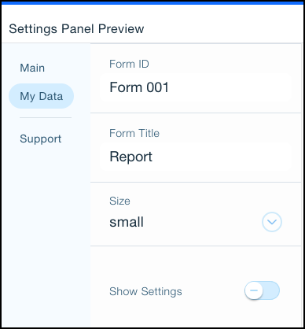

# About the Editor Deep Link API

This API generates a URL that adds an app’s components to a site owner’s site directly in the Editor. The API can be used to add a Custom Element together with its Settings panel.

> Note:
> The Custom Element is currently in beta testing, and is not available to all users. If you would like to request access, please submit a proposal.

## Terminology

**Editor Deep Link** - A link that sends a site owner to the Editor, adding an app’s components directly to the page.

[Custom Element](https://devforum.wix.com/kb/en/article/create-a-custom-element) - A website component that contains a custom script as well as custom parameters with UI control elements in a Settings panel.

## Use Cases

The Editor Deep Link API generates a URL that adds components to a site. It can be used in the following ways.

### Use Case 1: Add Components to a Page

The authorization token containing your App ID is used to generate a URL that adds the app’s components to a site owner's page. No body is required.

#### Request

```CURL
Curl -X  POST \
https://wixapis.com/apps/v1/post-installation/editor-deep-link \
-H 'Authorization: <AUTH>'
```

#### Response
```
{
   "url": <url>
}
```

### Use Case 2: Use the Deep Link With a Custom Element

Parameters for the Custom Element are passed in the body of the request and they are added to the Settings panel, described below.

#### Request

```CURL
Curl -X  POST \
https://wixapis.com/apps/v1/post-installation/editor-deep-link \
-H 'Authorization: <AUTH>'

-data-raw '{
  "custom_params": [
    {
      "key1": "value1",
      "key2": "value2"
    }
  ]
}'
```

#### Response

```JSON
{
   "url": <url>
}
```

> **Note:**
> Parameters passed in the body of the API request will only populate the Settings panel if their keys match the keys already present in the settings panel.

### Use Case 3: Use the Custom Element’s Settings Panel

Each Custom Element web component has its own Settings panel. Parameters may be added to the panel using the tabbed layout and a variety of UI controls that make it easy for your users.



When users install your app they have access to the same settings panel. Values set while developing the app are presented to users as default settings.


All key-value pairs are passed directly to the Settings panel of the custom element, and they don't need to be passed in the body of the API request.