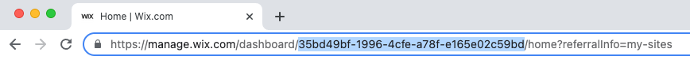

# API Keys

## Introduction

API keys allow users to make API calls to an account or individual site without needing OAuth authentication. Users assign a set of permissions to each key they create. Those permissions determine the types of APIs the key can access.

Learn about creating and managing API keys in this [article](https://support.wix.com/en/article/about-wix-api-keys).

>**Note**: API keys and this documentation are currently in beta.


## API Requests with API Keys

To make an API request using API keys, you will need:
- an API key token used for authentication.
- an account ID and/or site ID for the header as described below.

## Finding Account and Site IDs

#### Finding an Account ID

Your account ID can be found on the main page of the [API Keys Manager](https://manage.wix.com/account/api-keys).

#### Finding a Site ID

Site IDs are retrieved with Site List’s **Query Sites** API. This API requires authorization with the API key and an account ID.

The site ID for a current site can be obtained from the site URL in your browser. For example, the site ID appears after the '/dashboard/' part of this URL:



## Constructing the Header of an API Request

Construct the header for the API by using the API key for authorization instead of the OAuth token. Note that the API key does not need to be refreshed like the OAuth token.

In addition to authorization, API calls made with an API key require the header to contain the account ID and/or the site ID.

A complete header for an API request looks like this:

```
curl <GET/POST>\
‘<endpoint>’ \

-H 'Authorization: <APIKEY>' \
-H 'wix-account-id: <ACCOUNTID>' \
-H 'wix-site-id: <SITEID>' \
```

Add this header to the body of any of your API's to form a complete request.

## Account-Level and Site-Level API Requests

Depending on the API, an account ID and/or site ID must be included in the header of the API request.

For requests made at the account level, you must include the account ID in the header along with the API key for authentication. Some API’s will  require the site ID as well. This is indicated in the documentation for each account-level API.

With site-level API requests, the account ID can be ommitted.

### Account-Level Request Example: “Create Account” API

This API creates a new Wix account as a sub-account of a targetAccountId. It also creates a new Wix user who is defined as the account owner. The ID of the new account is returned.

**Request:**

```
curl POST \
'https://www.wixapis.com/accounts/v1/accounts/create' \
-H 'Authorization: <APIKEY>' \
-H 'wix-account-id: <ACCOUNTID>\

-d '{
“User”: {
     “Email”: [{“emailAddress”: “test@example.com”, “isVerified”: “true”}],
     “ssoIdentities”: [{“ssoid”: “test123”, “userid”: “test1234”}]
     “targetAccountId”: “0g44jm7b-4059-4e86-8k3e-d185b1d5s1g7”
}}' \
```

**Response:**

```
json:
{
  Account: [
    “accountId”: “0c87cd5d-4059-4e86-8f6e-d185b1e4a1bd”
  ]
}
```

### Site Level Request Example: “Query Products” API

This API lets you request a list of products from one of your sites. To query the API, you'll need an API key and the ID of the site you want to query.

**Request:**

```
curl POST \
'https://www.wixapis.com/stores/v1/products/query' \
-H 'Content-Type: application/json' \
-H 'Accept: application/json, text/plain, */*' \
-H 'Authorization: <APIKEY>' \
-H 'wix-site-id: <SITEID>'\

-d '{
"query": {
     "filter":"{\paymentStatus\":\"PAID\"},
     "sort':"{\"number\": \"desc\"}",
     "paging": {
          "limit":"50"
     }
}}' \
```

**Response:**

```json:
{
  products: [
   {
   "Id": "5376f9ec-b92e-efa9-e4a1-f4f480aa0d3a",
    "Name": "Indian Blend Coffee",
    "Size:": "1 lb",
    "Price": "4.35",
    etc….
}
```
