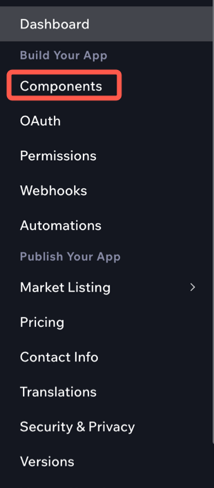
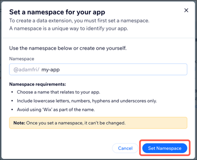

# About Extended Fields

> This feature is currently in developer preview. Features in developer preview are subject to change and are not intended for use in production.

The extended fields feature allows an app to extend the objects used by Wix's APIs with additional fields. You can use these fields to store data that isn't supported by the object. Extended fields are added to an app in the Wix Dev Center. Once extended fields are added for a particular object, they can be read and written using that object's API endpoints. This article explains how to add extended fields to an app and the details of reading and writing extended fields using APIs.

<!-- REMOVED FOR DEV PREVIEW

> **Note:** Not all the API objects support extended fields. If an object or endpoint supports extended fields, the following message is displayed in the API Reference: `This API supports extended fields. To use this feature, set it up in the Wix Dev Center. ` <!--TODO - Finalize the snippet/tag with Wix Docs - ->

-->

## Add extended fields to an app

To add extended fields for an API object to an app, do the following:

1. Open the [Wix Dev Center](https://dev.wix.com/apps/) and select the app you want to add extended fields for.
1. In the sidebar on the left, click **Components**.  
   
1. Hover over **Add Component** and select **Integration Component**.  
   
1. Select **Data Extension** and click **Add Component**.
1. If this is the first time you're adding extended fields to the app, you're prompted to create a namespace for the app. This namespace is used when reading and writing any extended fields created for the app.  
    
1. Choose the object you want to add extended fields to and click **Choose Entity**.  
   
1. Use the **JSON Editor** to define the extended fields you want to add the object in [JSON Schema](#json-schema) format.  
   The editor's linter indicates if there are any errors in the JSON Schema.
   
1. Once your extended fields are defined, click **Save**.  
   > **Important:** Once you add an extended field to an app, it can't be removed. You can [archive](#x-wix-archive) an extended field to prevent it from being read or written using APIs.

## Read and write extended fields
Once you add extended fields to an app, you can read and write them using the API endpoints for the object. 

### Read
To read extended field data, use the same API endpoint used to retrieve the object you extended. Your call returns any extended field data your app added to the object as well as data that you have permission to access that was added by other apps or site owners.

Extended fields are added to the main object in the `extendedFields` field. This field's value is an obejct containing a `namespaces` field. The `namespaces` object contains the extended field data for each app that has extended the main object. Each app in this object is identified by its namespace. Data added by site owners is included under the `_user_defined` namespace.

For example:
```json
{
  "extendedFields": {
    "namespaces": {
      "@account1/myApp": {
        "myField": "My field value",
        "myField2": "Another field value for the same app"
      },
      "@account2/anotherApp": {
        "appField": "A field value for a different app"
      },
      "_user_defined": {
        "userField": "A field value added by a site owner"
      }
    }
  }
}
```
> **Note:** When you read an object with extended fields, you can only retrieve the data that your app has permissions to read. For example, if the extended fields are defined by the owning app without adding `"apps"` to the [read permissions](#x-wix-permissions), other apps won't see those extended fields when they retrieve the object.

### Write
There are 2 ways to write extended field data: standard endpoints and dedicated endpoints.

#### Standard endpoints
You can write extended field data using the same API endpoints used to write the object you extended. Include the new or updated extended field data in the `extendedFields` field of the object, as in the [example above](#read). To delete the value of an extended field, set its value to `null`.

#### Dedicated endpoint
APIs that support extended fields also have a dedicated "Update Extended Fields" endpoint. You can use this endpoint to update only the extended fields of an object. If the object you extended has a `revision` field, you don't need to pass it when updating extended fields using a dedicated endpoint. This endpoint may require a permission scope that's different from the scope required to update the object itself. Dedicated endpoints use a slightly different data format. The namespace of the app whose data you want to update and the data itself are separated in the request body.

Example dedicated endpoint request body:
```json
{
  "namespace": "@account-name/app1",
	"namespaceData":{
	  "myField": "my field value"
  }
}
```

### Webhooks
When you update extended fields using either a standard or dedicated endpoint, the standard "Updated" webhook for the extended object is triggered. The webhook payload contains the updated object including the `extendedFields` field. The payload only includes data for extended fields whose [read permissions](#x-wix-permissions) include `"apps"`. The payload also includes a boolean value called `has_more_data`. This value is set to `true` if extended fields were updated that don't have `"apps"` in their read permissions. In this case, you can see the updated extended fields by reading the object using the appropriate API endpoint.

Here is an example of the `extendedFields` property in a webhook payload:
```json
{
  // ... Other object data
  "extendedFields": {
    "namespaces": {
      "@account-name/app1": {
        "myField": "my field value",
        "myField2": "another field value"
      }
    },
    "has_more_data": true
  }
}
```


## JSON Schema for extended fields
Extended fields are defined using a subset of [JSON schema](https://json-schema.org/). There are some general restrictions on the JSON schema to keep in mind when defining extended fields:
+ Extended field schemas can't contain more than 256 properties.
+ The maximum length of a property key is 64 characters.
+ Property keys must start with a letter and can contain only letters, numbers, and underscores.
+ The maximum storage size for extended fields for an object per app is 10 KB. This means that each site that installs your app can store up to 10 KB of extended field data for each object that your app extends. This limitation is applied to the schema. It's calculated based on the fields defined in the schema including the maximum lengths of all strings and the maximum items of all arrays.  

The extended fields feature supports all the basic JSON schema types with some restrictions, as follows:

### String
The `string` type is used to define a JSON schema [string](https://json-schema.org/understanding-json-schema/reference/string.html#string). Please note the following restrictions to the `string` definition:
+ [Length](https://json-schema.org/understanding-json-schema/reference/string.html#length): Strings must be between 1 and 10000 characters long. The maximum length of a `string` extended field must be defined using the `maxLength` keyword.
+ [Format](https://json-schema.org/understanding-json-schema/reference/string.html#format): The following formats are supported:
    + [Hostnames](https://json-schema.org/understanding-json-schema/reference/string.html#hostnames)
    + [Resource identifiers](https://json-schema.org/understanding-json-schema/reference/string.html#resource-identifiers)
    + [Dates](https://json-schema.org/understanding-json-schema/reference/string.html#dates-and-times). Only `date`, `date-time`, and `time` values are supported.
    + `single-line`: A custom Wix value. By default, all `string` extended fields are considered multi-line text. The `single-line` format indicates a field that can only contain a single line of text. The string must end with a newline character (`\n`).
       > **Note:** If a string is defined as `single-line`, the format can be removed later. However, if a string is created as multi-line text, the format can't be changed later to `single-line`.

### Numeric types
The `number` and `integer` types are used to define a JSON schema [numeric type](https://json-schema.org/understanding-json-schema/reference/numeric.html#numeric). The minimum value for a numeric extended field is `-2^53 + 1` and the maximum value is `2^53 + 1`.

### Object
The `object` type is used to define a JSON schema [object](https://json-schema.org/understanding-json-schema/reference/object.html#object). Please note the following restrictions to the `object` definition:
+ An `object` extended field's schema must contain a `properties` field that defines the properties of the object. 
+ The properties of an object must follow the all the restrictions of the other extended field types. 
+ There is a maximum of 10 nesting levels for an object.

### Array
The `array` type is used to define a JSON schema [array](https://json-schema.org/understanding-json-schema/reference/array.html#array).  Please note the following restrictions:
+ An `array` extended field's schema must contain an `items` field that defines the items in the array.
+ The items in the array must follow the all the restrictions of the other extended field types.
+ The maximum [length](https://json-schema.org/understanding-json-schema/reference/array.html#length) of an array is 100 items. The maximum number of items of an `array` extended field must be defined using the `maxItems` keyword.
+ All the items in an array must be the same type.
+ Arrays can only contain items of these types: `string`, `number`, `integer`, and `boolean`.

### Boolean
The `boolean` type is used to define a JSON schema [boolean](https://json-schema.org/understanding-json-schema/reference/boolean.html#boolean). There are no restrictions on the `boolean` type object.

### Global keywords
The following global JSON schema keywords are supported:
+ [Annotations](https://json-schema.org/understanding-json-schema/reference/generic.html#annotations) 
  <!-- Not relevant for first release>
  > **Note:** The `title` annotation keyword is used to display information about the extended field in the dashboard of sites that install your app. [Learn more](#title).
  <-->
+ [Enumerated values](https://json-schema.org/understanding-json-schema/reference/generic.html#enumerated-values)

The following global keywords are not supported:
+ `required`
+ `$defs`
+ `$ref`
+ `readOnly`
+ `writeOnly`

### Wix-specific keywords
Wix extends the JSON schema to support the following Wix-specific keywords:

#### `x-wix-permissions`
This keyword is used to define the permissions required to read and write an extended field. This keyword is required for all extended fields. Its is an object that defines read and write permissions in separate arrays. For example:
```json
"x-wix-permissions": {
  "read": ["owning-app", "apps", "users", "users-of-users"],
  "write": ["owning-app", "apps", "users"]
}
```
The supported permissions values are as follows:
+ `"owning-app"`: The app that defines the extended field.
+ `"apps"`: Other apps installed on a site together with the app that defines the extended field.
+ `"users"`: The owners of sites that have the owning app installed.
+ `"users-of-users"`: The site members of a site that have the owning app installed.

>**Note:** If you enable `users-of-users` permissions for reading or writing an extended field, you should also enable the same permissions for `users`. Otherwise, site owners won't be able to read or write the extended field data created by their site visitors.

#### `x-wix-archive`
This keyword is added to the schema of an existing extended field to archive the field. The value of this keyword is a boolean. Once an extended field is archived, it can't be read or written using APIs. If an archived extended field has nested fields, the nested fields are also archived. To restore an archived extended field, change the value of this keyword to `false` or remove it from the schema. 

For example:
```json
"myField": {
  "x-wix-archive": true,
  "type": "string",
  "maxLength": 100,
  "x-wix-permissions": {
    "read": ["apps"],
    "write": ["apps"]
  }
}
```
<!--
#### `x-wix-pii`
This keyword is used to indicate whether an extended field contains [personally identifiable information](https://support.wix.com/en/article/about-personally-identifiable-information-pii) (PII). The value of this keyword is a boolean. 

For example:
```json
"myField": {
  "x-wix-pii": true,
  "type": "string",
  "maxLength": 100
}
```
Note the following when using this keyword:
+ The `x-wix-pii` keyword is supported for the following extended field types: `string`, `number`, and `array` types containing only `string` or `number` items.
+ This keyword is optional. If it's not included, Wix assumes that the extended field doesn't contain PII.
+ Once an extended field is created, its PII status can't be changed. If you want to change the PII status of an extended field, you must archive the field and create a new field with the correct PII status.
+ When an extended field marked as PII is archived, the data associated with the field is deleted.
+ If you mark a field as PII, Wix makes the data available to site owners and their users in accordance with legal regulations such as GDPR.
-->

#### `x-wix-created-date`
This optional keyword is used to indicate the date and time when an extended field was created. The value of this keyword is a timestamp in [ISO 8601](https://en.wikipedia.org/wiki/ISO_8601) format. This keyword is included whenever the extended field is read.  
For example:
```json
"myField": {
  "x-wix-created-date": "2020-01-01T00:00:00.000Z",
  "type": "string",
  "maxLength": 100
}
```

<!-- Not relevant for first release>
#### `title`
In the extended fields schema the `title` annotation keyword is used as the label for the extended field in the dashboard of sites that install your app. For example, if your app extends the Bookings object, the `title` for extended field is used as the label for the field when a site owner adds a new booking in their dashboard.
<-->
### Example extended field schema
Here is an example of an extended field schema that defines `firstName`, `lastName`, and `age` fields. This is what the final schema looks like in the JSON Editor.
```json
{
  "type": "object",
  "properties":{
    "firstName": {
      "type": "string",
      "description": "The person's first name.",
      "x-wix-permissions": {
        "read":["apps"],
        "write":["users"]
      },
      "title":"First Name",
      "maxLength": 20
    },
    "lastName": {
      "type": "string",
      "description": "The person's last name.",
      "x-wix-permissions": {
        "read":["apps"],
        "write":["users"]
      },
      "title":"Last Name",
      "maxLength": 20
    },
    "age": {
      "description": "Age in years which must be equal to or greater than zero.",
      "type": "integer",
      "minimum": 0,
      "x-wix-permissions": {
        "read":["apps"],
        "write":["users"]
      },
      "title":"Age",
      "maxLength": 20
    }
  }
}
```