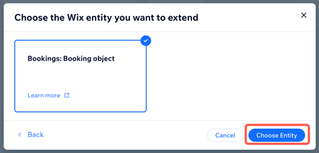

# About Extended Fields

The extended fields feature allows an app to extend the objects used by Wix's APIs with additional fields. You can use these fields to store information that isn't supported by the object's schema. Extended fields are added to an app in the Wix Dev Center. Once extended fields are added for a particular object, they can be read and written using that object's API endpoints. This article explains how to add extended fields to an app and the details of reading and writing extended fields using APIs.

<!-- REMOVED FOR DEV PREVIEW

> **Note:** Not all the API objects support extended fields. If an object or endpoint supports extended fields, the following message is displayed in the API Reference: `This API supports extended fields. To use this feature, set it up in the Wix Dev Center. ` <!--TODO - Finalize the snippet/tag with Wix Docs - ->

-->

## Add extended fields to an app

To add extended fields for an API object to an app, follow these steps:

1. Open the [Wix Dev Center](https://dev.wix.com/apps/) and select the app you want to add extended fields to.
1. In the sidebar on the left, click **Components**.  
   
1. Hover over **Add Component** and select **Integration Component**.  
   
1. Select **Data Extension** and click **Add Component**.
1. If this is the first time you're adding extended fields to the app, you're prompted to create a namespace for the app. This namespace is used when reading and writing any extended fields created for the app.  
   > **Note:** Once a namespace is created, it can't be changed.  
   
   
1. Choose the object you want to add extended fields to and click **Choose Entity**.  
   
1. Use the **JSON Editor** to define the extended fields you want to add the object in [JSON Schema](#json-schema) format.  
   The editor's linter indicates if there are any errors in the JSON Schema.
1. Once your extended fields are defined, click **Save**.  
   > **Important:** Once you add a extended field to an app, it can't be removed. You can [archive](#x-wix-archive) an extended field to prevent it from being read or written using the API.

## Read and write extended fields
Once you add extended fields to an app, you can read and write them using the API endpoints for the object. In both cases, extended fields are added to the main object using the `extendedFields` property. This property contains a `namespaces` object that contains the extended fields for each namespace. The namespace is the app's namespace that was created when the extended fields were added to the app. For example:
```json
{
  "extendedFields": {
    "namespaces": {
      "@my-name/app1": {
        "myField": "my field value"
      },
      "@account-name/app2": {
        "myOtherField": "my other field value"
      }
    }
  }
}
```

### Read
To read extended field data, use the same API endpoint used to retrieve object you extended. 

### Write
The endpoint used to write extended fields may be different depending on the object you extended. There are 2 possible options, unified endpoint and dedicated endpoint.

> **Note:** To delete the value of an extended field, set its value to `null`.

#### Unified Endpoint
If the object you extended has a unified endpoint, you can write extended field data using the same API endpoint used to write the object you extended. The extended fields are written to the `extendedFields` property of the object, as in the example above.

#### Dedicated Endpoint
In some cases, there is a dedicated API endpoint for updating extended fields. These endpoints may require a permission scope that's different from the scope required to update the object itself.

> **Note:** If the object you extended has a `revision` field, this field is not incremented when you update extended fields using a dedicated endpoint.

To check if there is a dedicated endpoint for updating your extended fields, see the API Reference for the object you are extending.


## JSON Schema
Extended fields are defined using a subset of [JSON schema](https://json-schema.org/). There are some general restrictions on the JSON schema to keep in mind when defining extended fields:
+ Extended field schemas can't contain more than 256 properties.
+ The maximum length of a property key is 64 characters.
+ Property keys must start with a letter and can contain only letters, numbers, and underscores.
+ The maximum storage size for an individual extended field object is 10 KB. This size is calculated based on the properties defined in the object's schema including the maximum lengths of all strings and the maximum items of all arrays.

The extended fields feature supports all the basic JSON schema types with some restrictions, as follows:

### String
The `string` type is used to define a JSON schema [string](https://json-schema.org/understanding-json-schema/reference/string.html#string). Please note the following restrictions to the `string` definition:
+ [Length](https://json-schema.org/understanding-json-schema/reference/string.html#length): Strings must be between 1 and 10000 characters long. The maximum length of an extended string field must be defined.
+ [Format](https://json-schema.org/understanding-json-schema/reference/string.html#format): The following formats are supported:
    + [Hostnames](https://json-schema.org/understanding-json-schema/reference/string.html#hostnames)
    + [Resource identifiers](https://json-schema.org/understanding-json-schema/reference/string.html#resource-identifiers)
    + [Dates](https://json-schema.org/understanding-json-schema/reference/string.html#dates-and-times). Only `date`, `date-time`, and `time` values are supported.
    + `single-line`: A custom Wix value. By default, all `string` extended fields are considered multi-line text. This format indicates a field that can only contain a single line of text. The string must end with a newline character (`\n`).
       > **Note:** If a string is defined as `single-line`, the format can be removed later. However, if a string is created as multi-line text, the format can't be changed later to `single-line`.

### Numeric types
The `number` and `integer` types are used to define a JSON schema [numeric type](https://json-schema.org/understanding-json-schema/reference/numeric.html#numeric). The minimum value for a numeric extended field is -2^53 + 1 and the maximum value is 2^53 + 1.

### Object
The `object` type is used to define a JSON schema [object](https://json-schema.org/understanding-json-schema/reference/object.html#object). Please note the following restrictions to the `object` definition:
+ `object` fields must contain a `properties` object that defines the properties of the object. 
+ The items in the properties object must follow the all the restrictions of the other extended field types. 
+ There is maximum of 10 nesting levels for an object.

### Array
The `array` type is used to define a JSON schema [array](https://json-schema.org/understanding-json-schema/reference/array.html#array).  Please note the following restrictions:
+ `array` fields must contain an `items` object that defines the items in the array.
+ The items in the array must follow the all the restrictions of the other extended field types.
+ [Length](https://json-schema.org/understanding-json-schema/reference/array.html#length): The maximum length of an array is 100 items. The maximum number of items of an array field must be defined.
+ All the items in an array must be the same type.
+ Arrays can only contain items of these types: `string`, `number`, `integer`, and `boolean`.


### Boolean
The `boolean` type is used to define JSON schema [boolean](https://json-schema.org/understanding-json-schema/reference/boolean.html#boolean). There are no restrictions on the `boolean` type object.

### Global keywords
The following global JSON schema keywords are supported:
+ [Annotations](https://json-schema.org/understanding-json-schema/reference/generic.html#annotations) 
  <!-- Not relevant for first release>
  > **Note:** The `title` annotation keyword is used to display information about the extended field in the dashboard of sites that install your app. [Learn more](#title).
  <-->
+ [Enumerated values](https://json-schema.org/understanding-json-schema/reference/generic.html#enumerated-values)

The following global keywords aren't supported:
+ `required`
+ `$defs`
+ `$ref`
+ `readOnly`
+ `writeOnly`

### Wix-specific keywords
We extended the JSON schema to support the following Wix-specific keywords:

#### `x-wix-permissions`
This keyword is used to define the permissions required to read and write an extended field. This keyword is required for all extended fields. The value of this keyword is an object that defines read and write permissions separately. For example:
```json
"x-wix-permissions": {
  "read": ["apps", "users", "users-of-users"],
  "write": ["apps", "users"]
}
```
The supported permissions values are as follows:
+ `apps`: Other apps installed on a site together with the app that defines the extended field.
+ `users`: The owners of sites that have the app installed.
+ `users-of-users`: A site owner's site members.

#### `x-wix-archive`
This keyword is used to archive an extended field. The value of this keyword is a boolean. Once an extended field is archived, it can't be read or written using the API. If an archived extended field has nested fields, the nested fields are also archived. To unarchive an extended field, change the value of this keyword to `false` or remove it from the schema. 

For example:
```json
"myField": {
  "x-wix-archive": true,
  "type": "string",
  "maxLength": 100,
  "x-wix-permissions": {
    "read": ["apps"],
    "write": ["apps"]
  },
}
```

<!-- Not relevant for first release>
#### `title`
In the extended fields schema the `title` annotation keyword is used as the label for the extended field in the dashboard of sites that install your app. For example, if your app extends the Bookings object, the `title` for extended field is used as the label for the field when a site owner adds a new booking in their dashboard.
<-->
### Example extended field schema
Here is an example of an extended field schema that defines `firstName`, `lastName`, and `age` properties.
```json
{
  "firstName": {
    "type": "string",
    "description": "The person's first name.",
    "x-wix-permissions": {
      "read":["apps"],
      "write":["users"]
    },
    "title":"First Name",
    "maxLength": 20
  },
  "lastName": {
    "type": "string",
    "description": "The person's last name.",
    "x-wix-permissions": {
      "read":["apps"],
      "write":["users"]
    },
    "title":"Last Name",
    "maxLength": 20
  },
  "age": {
    "description": "Age in years which must be equal to or greater than zero.",
    "type": "integer",
    "minimum": 0,
    "x-wix-permissions": {
      "read":["apps"],
      "write":["users"]
    },
    "title":"Age",
    "maxLength": 20
  }
}
```