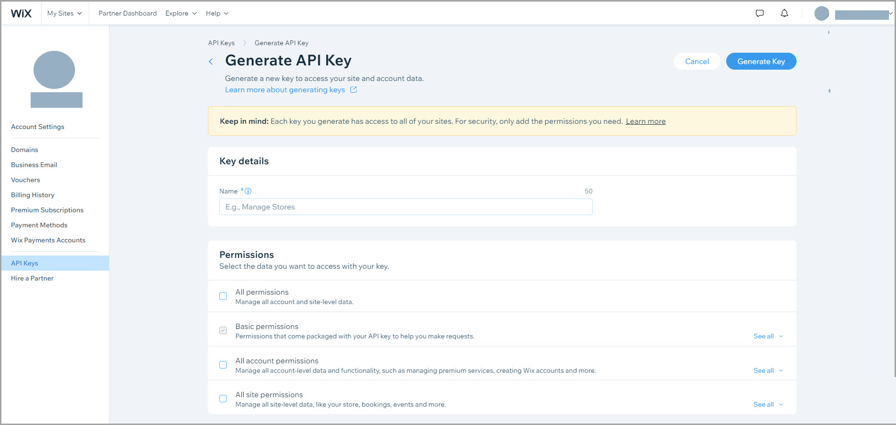

# About API Keys

API keys are authentication tools that account owners and co-owners can create and provide to external developers, enabling them to make API calls at the account and site level while bypassing OAuth authentication. 

> **Note:**
> Currently only account owners and co-owners can create API keys. 

[API keys](https://support.wix.com/en/article/about-wix-api-keys) are created and managed in the [API Keys Manager](https://manage.wix.com/account/api-keys) where you can assign a set of permissions that determine the types of APIs the key can access.



## Create and use API keys

1. Create or request an API key.
- If you have direct access to the account, create a key with the relevant permissions in the [API Keys Manager](https://manage.wix.com/account/api-keys). Collect the key and the account ID.
- If you don't have direct access to the account, request the key and the account ID from the account owner.  

2. Call the Site API's **Query Sites** endpoint to collect all the account's associated site IDs.

  > **Note:**
  > The site ID for a current site can be obtained from the site URL in your browser.
  > For example, the site ID appears after the '/dashboard/' part of this URL: <br />
  > <br />
  > 

3. When making API calls, enter the API key in the authorization header. Note that the API key does not need to be refreshed. 

    Calls may require either the account ID header or the site ID header (but not both). Refer to the documentation for each specific call to know which one to use.
    
    A complete header for an account-level API request looks like this:
    ```sh
    curl <GET/POST> \
      '<endpoint>' \
      -H 'Authorization: <APIKEY>' \
      -H 'wix-account-id: <ACCOUNTID>' \
    ```
    A complete header for a site-level API request looks like this:
    ```sh
    curl <GET/POST> \
      '<endpoint>' \
      -H 'Authorization: <APIKEY>' \
      -H 'wix-site-id: <SITEID>' \
    ```
Keep in mind that site-level calls only work with API keys from the site's owner account. If you work with multiple API keys, make sure you're using the correct key that matches your target site's ownership.

## Account-level and site-level API requests

Depending on the call, either an account ID or a site ID must be included in the header of the API request.

For requests made exclusively at the [account level](https://dev.wix.com/docs/rest/account-level/about-account-level-apis), you must include the account ID in the header along with the API key for authentication. Requests made at the site level require the site ID instead. This is indicated in the documentation for each API. Don’t pass both, as this may result in an error.

### Sample request: Site Folders API - Create Folder

This API creates a new folder that can hold Wix sites.

**Request:**

```sh
curl POST \
'https://www.wixapis.com/site-folders/v2/folders' \
-H 'Authorization: <APIKEY>' \
-H 'wix-account-id: <ACCOUNTID>' \
-d '{
      "folder": {
        "name": "My Folder",
        "parentId": "root"
      }
    }'
```

**Response:**

```json
{
  "folder": {
    "id": "283f4660-8f6f-462b-94a1-160a57338032",
    "name": "My Folder",
    "createdDate": "2021-12-13T11:33:56.973Z",
    "updatedDate": "2021-12-13T11:33:56.973Z",
    "siteCount": 0,
    "parentId": ""
  }
}
```

### Sample Request: Stores API - Query Products

This API retrieves a list of products from one of the account's sites. To make this call, you'll need an API key and the ID of the site you want to query.

**Request:**

```sh
curl POST \
'https://www.wixapis.com/stores/v1/products/query' \
-H 'Content-Type: application/json' \
-H 'Accept: application/json, text/plain, */*' \
-H 'Authorization: <APIKEY>' \
-H 'wix-site-id: <SITEID>' \
-d '{
      "query": {
        "filter": "{\"paymentStatus\":\"PAID\"}",
        "sort": "{\"number\": \"desc\"}",
        "paging": {
          "limit": "50"
        }
      }
    }'
```

**Response:**

```json:
{
  "products": [
    {
      "Id": "5376f9ec-b92e-efa9-e4a1-f4f480aa0d3a",
      "Name": "Indian Blend Coffee",
      "Size:": "1 lb",
      "Price": "4.35",
      // ...
    }
  ]
}
```
