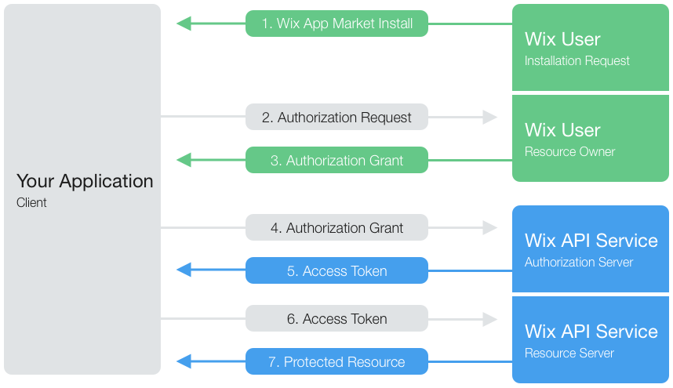
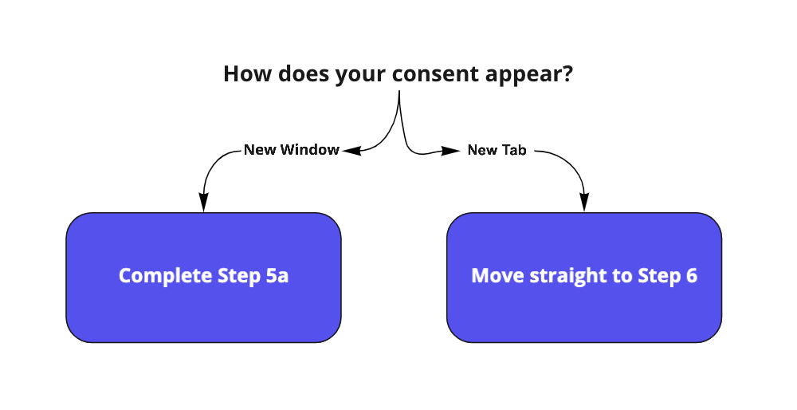
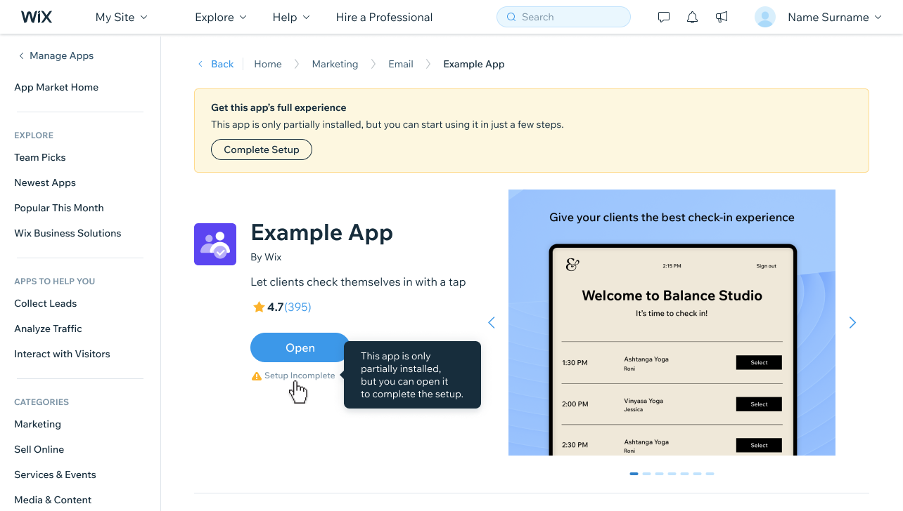

# Authentication
When a site owner installs your app, they will grant you permission to collect their site data during the installation flow, which is based on the settings you provide in the Wix Developers Center. You will then receive an authorization code which you will use to request an access token and a refresh token. Then you’ll pass the access token as an authorization header in the API call.
> **Note:**  
> Access and refresh tokens are user-specific. [Access tokens](https://dev.wix.com/api/rest/authorization/oauth-2/refresh-an-access-token) are valid for 5 minutes. Refresh tokens are valid as long as the app is installed on the user's site. 

> **Note:** 
> In certain installation flows, Wix will load your app and redirect URLs in an iframe.
> Make sure your content can be loaded on an iframe. For example, make sure you don't send the header 'X-FRAME-OPTIONS'

# The OAuth Flow
We use [OAuth 2.0](https://tools.ietf.org/html/rfc6749) to authorize you to access our APIs and receive webhooks. 
> **Note:**  
> You’ll need to [set up OAuth, Permissions, and Webhooks settings](https://devforum.wix.com/en/article/setting-up-oauth-permissions-and-webhooks-in-the-wix-developers-center) in the Wix Developers Center.  



## Step 1: User Installs Your App
When the user chooses to install your app from within the Wix App Market, we redirect users to the App URL you defined in the Wix Developers Center. We include a `token` query parameter when we direct users to your App URL (we use it to keep track of the user as they go through the OAuth flow).
> **Note:**  
> This redirect to the App URL is a back-end process only. The user shouldn't have to log in or sign up here - send them straight to the authorization request step described next.

<blockquote class='important'>
  <p>
    <strong>Important:</strong><br/>
    When the user installs your app from your own platform, skip this step and go straight to step 2.
    The user can choose whether to install from the Wix App Market or your platform, but your app must support both flows.
  </p>
</blockquote>

## Step 2: App Sends Users to Authorize the App 
Your app should redirect users to the URL below so that we can ask them to approve a list of permissions your app is requesting (based on the [permissions](../guides/Permissions.md) you added in the Wix Developers Center).  

<br/>

Redirect users to the following URL:  
`https://www.wix.com/installer/install`  

<br/>

Send the following query parameters with the URL above:
- `token` (*required during installation from Wix only*): The token you received as a query parameter to the App URL. We use it to keep track of users as they go through the OAuth flow.
- `appId`: Your App ID, as defined in the Wix Developers Center. 
- `redirectUrl`: One of the redirect URLs you defined in the Wix Developers Center. You may define a separate redirect URL for each workflow (e.g., from the App Market and from your platform).
- `state` (*optional*): You can add a unique string to identify users that were authenticated in the previous step. This is how you'll identify the user when we send them to your redirect URL.
<blockquote class='important'>
  <p>
    <strong>Important:</strong><br/>
    Every redirect URL your app might use must be defined in the Wix Developers Center in advance.
  </p>
</blockquote>

## Step 2a: User Authorizes the App
When the user approves the permissions your app has requested, Wix will continue to the next step. 

## Step 3: Wix Redirects the User to App Server With an Authorization Code
Wix will redirect the user back to your specified `redirectUrl` along the following query parameters:
* `code` - A temporary authorization code, valid for up to 10 minutes. You’ll need this to request an access token to use our API. 
* `state` - The same value in case you provided one in the previous step. If the states don't match, the request may have been created by a third party and you should abort the process.
* `instanceId` - The unique ID created for your app installation in the user specific site. All of your app’s components in the site share the same [instance ID](https://devforum.wix.com/en/article/identifying-your-users). Your app should always identify users using the instance ID.  

<blockquote class='important'>
  <p>
    <strong>Important:</strong><br/>
    If your app requires user login or signup - do so here.
  </p>
</blockquote>  

<blockquote class='Note'>
  <p> 
     <strong>Note:</strong><br/>
After this step, the user is done. However, your app still has some work to do.
    </p>
</blockquote> 

## Step 4: App Submits the Authorization Code 
Once the user completes the installation process and gives your app permission to access their data, use the temporary authorization code we sent you, together with your secret key, to request an access token and a refresh token. (The access token is only valid for 5 minutes.) 

> You can find your secret key in the [Wix Developers Center](https://dev.wix.com).

> **Deprecation:** We updated the OAuth endpoint URL in the code below. If you're still using the old URL, then you'll need to change this by December 1st, 2022.

<blockquote class='important'>
  <p>
    <strong>Important:</strong><br/>
    This request must be a secure, server-to-server request.
  </p>
</blockquote>  

Exchange the temporary authorization code for an access token using the [OAuth > Access Token Request](https://dev.wix.com/api/rest/authorization/oauth-2/request-an-access-token) API method:  

```  
curl -X POST \
  https://www.wixapis.com/oauth/access \
  -H 'Content-Type: application/json' \
  -d '{
    "grant_type": "authorization_code",
    "client_id": <APP_ID>,
    "client_secret": <APP_SECRET>,
    "code": <AUTH_CODE>
  }
```

## Step 5: App Receives Access and Refresh Tokens
Wix will respond to your request in step 4 with a JSON response containing an access token and a refresh token (These tokens are not relevant for webhooks):
```
{
   "refresh_token": <REFRESH_TOKEN>,
   "access_token": <FRESH_ACCESS_TOKEN>
}
```
> **Note:**  
> Request a new access token every time you call an API.
> Access tokens expire after 5 minutes. Use your refresh token to request a new access token.  

## Step 5a: App Completes the OAuth Flow

> **Note:**
>This step is only required for apps that display their consent in a new window, not a new tab. This is primarily for apps with a dashboard component that opens inside of Wix as an iframe, or another internal component.



Now that you have access and refresh tokens, you must close the consent window by redirecting the user to the following URL with the user's access token after the equals sign (`=`):

```
https://www.wix.com/installer/close-window?access_token=<ACCESS_TOKEN>
```

## Step 6: App Requests Protected Data
Follow our [API Reference](https://dev.wix.com/api/rest/app-management) section to request the user's protected data, with a fresh access token as the authorization header.

> **Important**:  
For all future API calls, you will need to [request a new access token](https://dev.wix.com/api/rest/authorization/oauth-2/refresh-an-access-token), using the refresh token you received in step 5. 

## Step 7: App Finishes Installation

At this point your app is designated “**Setup Incomplete**”. This state is useful if your app requires users to create an account or set other configuration parameters in order for the app to become active.

Once your app requires no further setup steps, create the following request to mark the installation as finished:

```
curl -X POST \
 https://www.wixapis.com/apps/v1/bi-event \
 -H 'Authorization: <AUTH>' \
 -d '{
   	"eventName": "APP_FINISHED_CONFIGURATION"
  	}’
\
```

>**Note:**
>Until the endpoint is called, the app is marked as "Setup Incomplete" in the Wix database.


