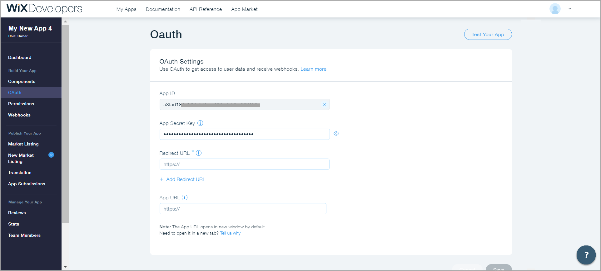
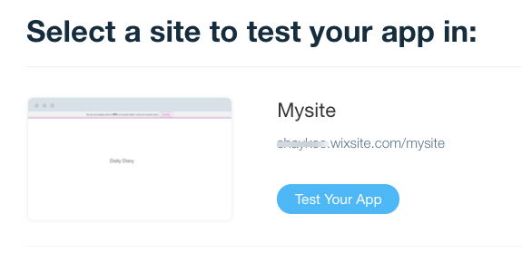

# Tutorial: Create Your First Wix App
In this tutorial we review how to create a Wix application that interacts with the Wix platform and you can submit to the Wix App Market, where Wix site owners can deploy it on their sites.   

## Step 1: Set Up Your App in a Wix Developers Account 
1. Log in (or sign up) to [Wix Developers](https://dev.wix.com/).
2. Click **Create New App**.
3. Go to **Workspace** > **OAuth** and copy your App ID and App Secret Key - you'll need them later.

## Step 2: Set Up Your App to Receive Inbound HTTPS Connections
Since most developers machines are not open for inbound connection and don't have HTTPS certificates, we will describe the process using **ngrok**.  
(If you are hosting your application on a server without these restrictions, you can skip this step.)

1. Install and run [ngrok](https://dashboard.ngrok.com/get-started).
2. Start an HTTP tunnel on the port your app is listening on  (default is 3000).
  You should get something like this:  

3. Make note of the forwarding URL - you'll need it later.

<blockquote class='important'>

  <strong>Important:</strong> 
Don't close the ngrok process - You will need it running for the entire process.

</blockquote>

## Step 3: Enter Your App URLs in the Wix Developers Center
1. Go to **Workspace** > **OAuth**:     
   a. In **Redirect URL** enter: `https://<NGROK_STRING>.ngrok.io/login`     
   b. In **App URL** enter: `https://<NGROK_STRING>.ngrok.io/signup`     

<blockquote class='important'>

  <strong>Important:</strong> 
Remember to replace <NGROK_STRING> with the string from the forwarding URL in step 2 ('18ab6468' in the example above).  

</blockquote>

2. Click **Save**.

## Step 4: Register For a Webhook
1. Go to **Workspace** > **Webhooks** and click **+ Add Webhook**.
2. Select the **App Management** webhook category and the **APP INSTALLED** event.  

3. Set up the webhook callback URL to https://<12345678>.ngrok.io/webhook-callback.  
  

<blockquote class='important'>

  <strong>Important:</strong> 
Remember to replace '12345678' with your ngrok string from step 2.  

</blockquote>

4. Click **Save**.
  Now you should see your Public key on the bottom of the screen. 
5. Copy your Public key - you'll need it later.

## Step 5: Create and Run Your App

1. Download and install [npm](https://www.npmjs.com/get-npm).
2. Clone the [Wix Sample Application](https://github.com/shaykewix/sample-wix-rest-app) to your machine.
3. Go to **src** > **config.js**:  
  a. Find and replace the APP_ID with the value you copied from Wix Developers:  

  b. Find and replace the PUBLIC_KEY with the value you copied from Wix Developers:

  
4. Go to **src** > **credentials.js**:
  a. Find and replace the APP_SECRET  with the value you copied from Wix Developers:

5. Run your app:  
  a. Browse to the cloned sample application.  
  b. Run `npm install`.  
  c. Run `npm build`.  
  d. Run `npm start`.  
  You should get something like this:  

Well done! Now it's time to make sure your app works as expected.

## Step 6: Test Your App

1. In the Wix Developers Center Workspace, click **Test Your App**.  
  

2. Select a site and click **Test Your App**.  

3. When prompted, click **Add To Site**.  

4. Provide consent for the app to collect data by clicking **Allow and Install**.  

5. You should get a print into the browser with your application ID and your site instance ID.  

## Congrats, you're done!
**Now you can add your app logic and other WIX APIs to your app.**
