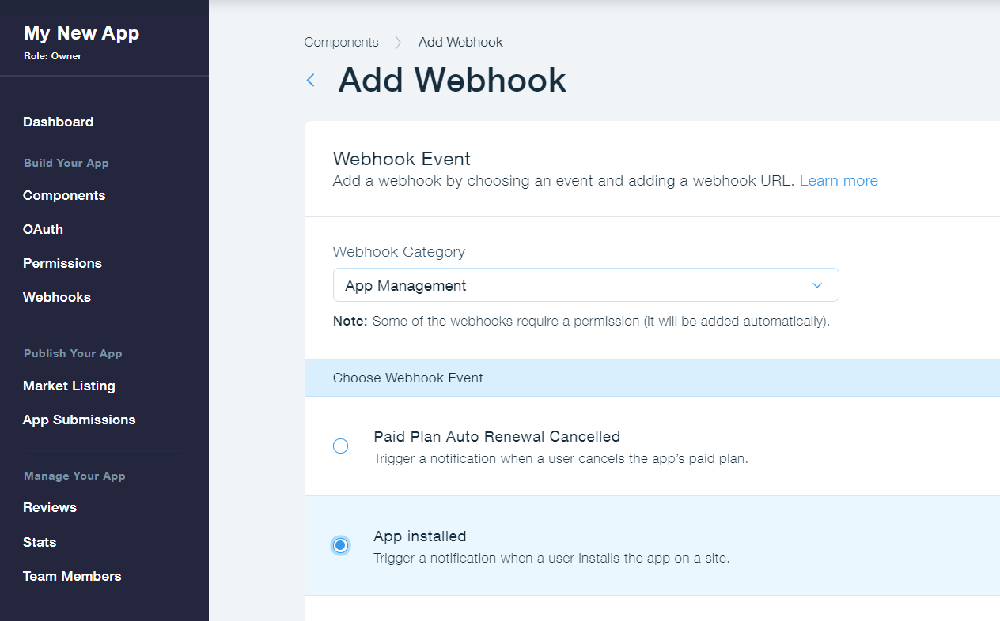

# Overview

You can use our various REST APIs to access Wix user's site data (e.g., contacts, orders, etc.). Our APIs use standard HTTPS terminology and OAuth authentication, and return JSON-encoded responses.
To use our APIs, site owners must grant you explicit permission to collect this data when installing your app on their site.

  <blockquote class='important'>

  <strong>Important:</strong> 
Use of Wix APIs are subject to the Wix App Market<a target="_blank" href="https://devforum.wix.com/en/article/app-market-guidelines"> Guidelines</a>.

</blockquote>

## Test Relative links
[relative link to Overview hahs](#Overview)

[relative link to Data payloads](Data%20Payloads.md)

[relative link to Apps/Introduction](../all/guides/apps/Introduction.md)

[relative link to About app management](../app-management/guides/About%20App%20Management.md)

[relative link to Stores - carts](../wix-stores/guides/carts/Introduction.md)

[relative link to Stores - inventory](../all/guides/stores-inventory/Introduction.md)

[relative link to CRM - contacts inrtoduction](../all/guides/contacts/Introduction.md)

[relative link to Site-properties Public inrtoduction](../all/guides/site-properties/Public%20Introduction.md)

[relative link to Stores - Rich text](../wix-stores/guides/Rich%20Text.md)

## Test Absolute links to the same site (LOCAL)

[Absolute link to Update Inventory Status](http://local.wix.com:3000/wix-stores/inventory/get-inventory-variants)

[Absolute link to  Contacts](http://local.wix.com:3000/wix-docs/development/contacts)

[Absolute link to  Wix stores pagination](http://local.wix.com:3000/wix-stores/pagination)

[Absolute link to  Wix-stores/print-orders/introduction](http://local.wix.com:3000/wix-stores/print-orders/introduction)

[Absolute link to  Wix-stores/catalog/collection/create-collection](http://local.wix.com:3000/wix-stores/catalog/collection/create-collection)

## Test Absolute links to the same site

[Absolute link to Update Inventory Status](https://bo.wix.com/wix-docs/development/wix-stores/inventory/get-inventory-variants)

[Absolute link to  Contacts](https://bo.wix.com/wix-docs/development/contacts)

[Absolute link to  Wix stores pagination](https://bo.wix.com/wix-docs/development/wix-stores/pagination)

[Absolute link to  Wix-stores/print-orders/introduction](https://bo.wix.com/wix-docs/development/wix-stores/print-orders/introduction)

[Absolute link to  Wix-stores/catalog/collection/create-collection](https://bo.wix.com/wix-docs/development/wix-stores/catalog/collection/create-collection)

## Test Absolute links that should not replace

[Absolute link with diffetent host](https://www.wix.com/wix-docs/development/contacts)

[Absolute link with diffetent baseUrl](https://bo.wix.com/wix-docs/test/contacts)

[Absolute link with same host and baseUrl but endpoint that not exist](https://bo.wix.com/wix-docs/development/test/contacts)

## Test valid Absolute links
[google](https://www.google.com)

[rest viewer](https://bo.wix.com/wix-docs/rest)

<blockquote class='tip'>

  <strong>Tip:</strong> 
There's more information available in our <a target="_blank" href="https://devforum.wix.com/en/article/api-faq">FAQ</a>.

</blockquote>
