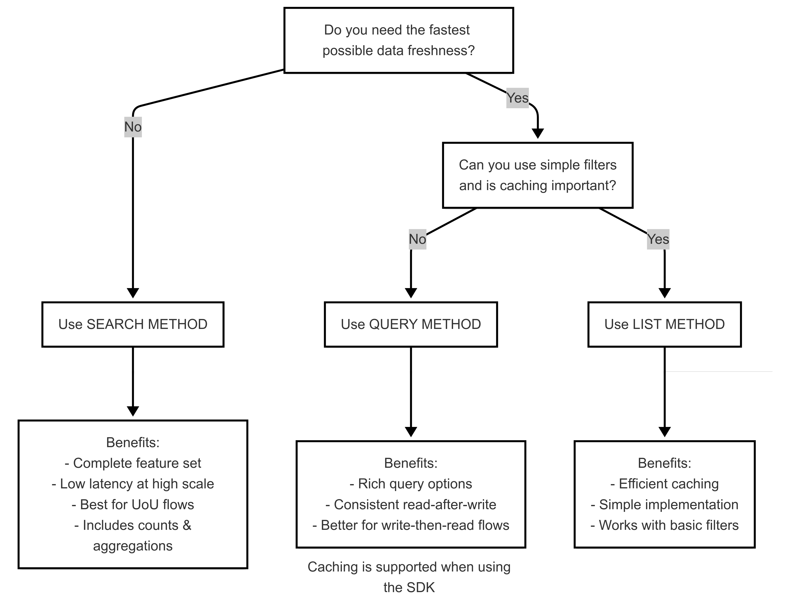

# Search, Query and List Methods

When working with Wix APIs, you'll notice that some APIs provide a mix of search, query, or list methods. Understanding the differences between these methods will help you choose the most appropriate one for your use case.

All three methods retrieve collections of items, but they're optimized for different scenarios:

* **Search methods** provide powerful text search functionality, aggregations, and result counting.
* **Query methods** are designed for efficient, low-latency data retrieval with predictable filtering and sorting capabilities.
* **List methods** provide simple, straightforward access to collections with basic pagination options. Generally only avaialable for collections that are limited in size.

> **Note:** The Wix Data Items API has a dedicated Aggregate method, XXX.

## Key differences

| Feature | Search | Query | List |
|---------|------|-------|--------|
| Purpose | Discovery and exploration | Efficient filtered data access | Basic collection access |
| Complexity | Complex | Moderate | Simple |
| Consistency | Eventually consistent, higher latency for availability of created and updated records than list| Eventually consistent, higher latency for availability of created and updated records than list | Eventually consistent, lower latency |
| Result Count | Includes total count automatically in the first page | Not included; separate count endpoint may be available | Not included; separate count endpoint may be available  |
Filtering | Advanced text and field-based filtering | Extensive field-based filtering | Limited field-based filtering |
| Sorting | Flexible field-based sorting | Flexible field-based sorting | Limited, often predefined options |
| Aggregations | Supported | Not supported | Not supported |
| Free-text Search | Supported across multiple fields | Not supported | Not supported |
| Performance | Optimized for search capabilities  | Optimized for sorting and filtering | Good performance for simple queries |
| Pagination | Cursor-based for efficiency, offset/limit may be available | Cursor-based for efficiency, offset/limit may be available | Cursor-based for efficiency, offset/limit may be available |

## Search method characteristics
Search methods typically have these features:
- Advanced text search capabilities across multiple fields.
- Support for both structured filtering and free-text search.
- Fuzzy matching for spelling tolerance and typo forgiveness.
- Phrase matching for exact sequence detection.
- Field boosting to prioritize matches in specific fields.
- Automatic total result counting with the first page of results.
- Complex aggregation capabilities:
  - Count aggregations for faceted navigation.
  - Sum and average calculations on numeric fields.
  - Min/Max value detection.
  - Distinct count operations.
- Facet generation for filtered navigation interfaces.
- Higher latency compared to List methods.
- Designed for discovery-oriented user experiences.
- Suitable for building search boxes, filters, and exploratory interfaces.
- Often supports highlighting of matched text in results.
- REST: POST endpoints with comprehensive JSON configuration bodies.
- Support for complex filtering expressions with logical operators. Common operators include:  

  | Expression type | SDK & REST |  
  |----------------|------|  
  | Equal to | `$eq` |  
  | Not equal to |  `$ne`|
  | Greater than |  `$gt` |  
  | Greater than or equal to |  `$gte` |  
  | Less than |  `$lt` |  
  | Less than or equal to |  `$lte` |  
  | In a specified list |  `$in` |  
  | Field exists check |  `$exists` |  
  | String starts with |  `$startsWith` |  


## Query method characteristics

Query methods typically have these features:

- Field-specific sorting with direction control.
- Efficient cursor-based pagination for handling large datasets.
- Often allows multiple filter conditions to be combined.
- Optimized for low-latency data access patterns.
- No support for text search or aggregations.
- REST: HTTP POST endpoints with a JSON request body.
- Support for complex filtering expressions with logical operators. Common operators include:  

  | Expression type | SDK | REST |  
  |----------------|-----|------|  
  | Equal to | `eq()` | `$eq` |  
  | Not equal to | `ne()` | `$ne`|
  | Greater than | `gt()` | `$gt` |  
  | Greater than or equal to | `ge()` | `$gte` |  
  | Less than | `lt()` | `$lt` |  
  | Less than or equal to | `le()` | `$lte` |  
  | In a specified list | `in()` | `$in` |  
  | Field exists check | `exists()` | `$exists` |  
  | String starts with | `startsWith()` | `$startsWith` |  


## List method characteristics

List methods typically have these features:
* Basic field-based filtering.
* Usually have the simplest implementation requirements.
* Limited or no sorting capabilities beyond defaults.
* Suitable for dropdown menus, simple listings, and basic data display.
* REST: HTTP GET endpoints (though some use POST).

## Method selection guide

When choosing between search, query, and list methods for your data retrieval needs, use decision tree below  to guide you to the most appropriate method based on your data retrieval needs, and your requirements for data freshness, filtering complexity, and caching.



## Example use cases
These examples illustrate common applications for both methods in the [Payment Links API](https://dev.wix.com/docs/rest/business-management/get-paid/payment-links/payment-links/introduction).

### Search example: Finding payment links containing "test" with aggregated counts by status

A business may want to identify all test payment links and check what types of tests were run.

```
curl -X POST \
  'https://www.wixapis.com/payment-links/v1/payment-links/search' \
  -H 'Authorization: <AUTH>' \
  -H 'Content-Type: application/json' \
  --data-binary '{
    "search": {
      "sort": [
        {
          "fieldName": "createdDate",
          "order": "DESC"
        }
      ],
      "aggregations": [
        {
          "name": "statuses",
          "type": "VALUE",
          "fieldPath": "status",
          "value": {
            "sortType": "COUNT"
          }
        }
      ],
      "search": {
        "fuzzy": true,
        "expression": "Test",
        "fields": [
          "title"
        ]
      }
    }
  }'
```


### Query example: Retrieve a list of payment links filtered by price and sorted by creation date
A business may want to review all payment links for premium offerings to ensure the most recent links reflect current marketing strategies.   
You can retrieve a list of payment links filtered by a specific price range and sorted chronologically by creation date with the following call:
```
curl -X POST \
  'https://www.wixapis.com/payment-links/v1/payment-links/query' \
  -H 'Authorization: <AUTH>' \
  -H 'Content-Type: application/json' \
  --data-binary '{
    "query": {
      "filter": {
        "price": {
          "$gt": 100,
        }
      },
      "sort": [
        {
          "fieldName": "createdDate",
          "order": "DESC"
        }
      ],
      "cursorPaging": {
        "limit": 1
      }
    }
  }'
```

### List example: Retrieving all payment links with basic pagination

A business needs to display a list of all their payment links in a dashboard with page navigation.

```
curl -X GET \
  'https://www.wixapis.com/payment-links/v1/payment-links?limit=10&offset=0' \
  -H 'Authorization: <AUTH>'
```
