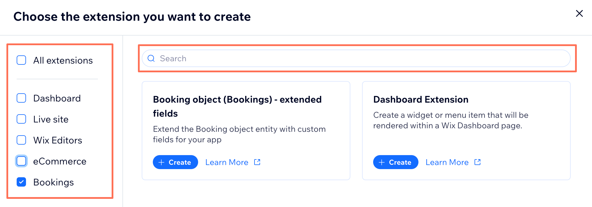
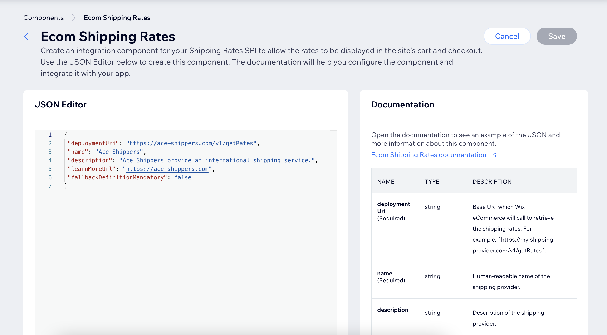

# SPI - Service Provider Interface

## Introduction

SPIs are APIs that are defined by Wix, which you may choose to implement.
By doing so, you will become  a _service provider_, and then Wix will call your application during a certain flow, wait for your response, 
and continue the flow with your response.  

For example, a _Local Delivery Provider_ application may implement the _Restaurants Local Delivery SPI_ that includes a `Get Delivery Estimate` endpoint. 
Once installed and enabled on a site, this provider will be called to fetch applicable delivery estimates during the customer’s checkout flow on that site.

## Terminology
* _SPI_ - Service Provider Interface - the API specification that has to be implemented by _Service Providers_.
* _SPI Host_ - the Wix service that calls your application during one of its business flows.  
* _Service Provider_  (a.k.a. _implementer_) - the application that implements the _SPI_.  
* _Public Key_ - a key available to you in the Wix Developers Center to verify Wix’s request signatures.  
* _Events_ - asynchronous events sent from the _service provider_ to the _SPI host_ (the equivalent of an API call under other circumstances, and using the standard OAuth2 authorization).

## Setup
In order to become a _service provider_, you have two options:
* Register an application in the Wix Developers Center, and add the extension that you wish to implement as described below. 
* Become a _service provider_ in a single site by implementing the SPI using Velo. 

### Configure an extension in the Development Center
In order to enable Wix to communicate with your app, add configurations for your extension:
1. In the side menu under **Build your app**, click **Extensions** .
2. In the upper right corner of the page, select **Create Extension**.
3. Select the relevant component and click **Createt**. You can filter by tag or search to find the extension you need.

     
   
4. In the JSON editor, configure the parameters by referencing the **Documentation** section on the right side of the page. For each parameter, add the parameter name and value in the JSON editor.

      

5. Click **Save**.

> **Note:**
> If you are working with a legacy SPI, configuration may not be via the Wix Developers Center. See instructions in the specific SPI. 

## Request envelope
As a _Service Provider_ you are required to implement an API specification exactly as documented. Each request that your endpoints will receive 
will be wrapped in an envelope with some metadata and signed.

The payload that your endpoints will receive will be in JWT format, with the following structure:

```json
{
  "data": {
    "request": {/*as specified in the SPI reference*/},
    "metadata": {/*as explained below*/}
  },
  "aud": "<your application's appId>",
  "iss": "wix.com",
  "iat": <issue timestamp>,
  "exp": <expiration timestamp>
}
```

The `metadata` in the envelope is common to all SPI endpoints, although some attributes will only appear in specific endpoints.

The following envelope attributes are:
* `requestId` - a unique identifier of the request. You may print this ID to your logs to help with future debugging and easier correlation with Wix' logs.
* `instanceId` - The Service Provider App's instance ID. 
* `currency` - [ISO 4217](https://en.wikipedia.org/wiki/ISO_4217) 3 letter currency code.
* `languages` - a string that represents the country and language in which the response from the Service Provider is expected to be returned in concatenated  [ISO 639-1: 2 Alpha language-code](https://en.wikipedia.org/wiki/List_of_ISO_639-1_codes) and [ISO 3166-1: 2 Alpha country-code](https://en.wikipedia.org/wiki/ISO_3166-1) format. E.g. `en-US`.
* `identity` - An object that describes the identity that triggered this request, with the following structure:

```json
{
  type: "<identity type>", // SITE_VISITOR, SITE_MEMBER, WIX_USER, APPLICATION
  siteMemberId: "<memberId>",
  siteVisitorId: "<visitorId>",
  userId: "<userId>",
  applicationId: "<applicationId>"
}
```

## Validating request signatures
As explained above, the request payload is a signed JWT. In order to avoid an attack where a malicious 3rd party is sending you requests pretending to come from Wix, you MUST verify the JWT, as follows:
* Verify the JWT signature using your [public key](https://devforum.wix.com/kb/en/article/finding-your-apps-public-key) from the Wix Developers Center.
* Verify that the `aud` claim matches your application id.
* Verify that the `iss` claim  is set to `wix.com`.
* Verify that the `iat` claim is set to a timestamp _before_ current on your server.
* Verify that the `exp` claim is set to a timestamp _after_ the current timestamp on your server.

It is **strongly** recommended that you use a standard library to parse and validate the JWT. There are popular libraries for all popular languages. Check out [JWT official site](https://jwt.io/libraries)

## Events
Some flows require that your application send asynchronous events (webhooks) to the Wix _SPI host server_. These flows are documented in the SPI reference.
To report an event, you MUST call the endpoint that appears in SPI reference, and send the required payload.
