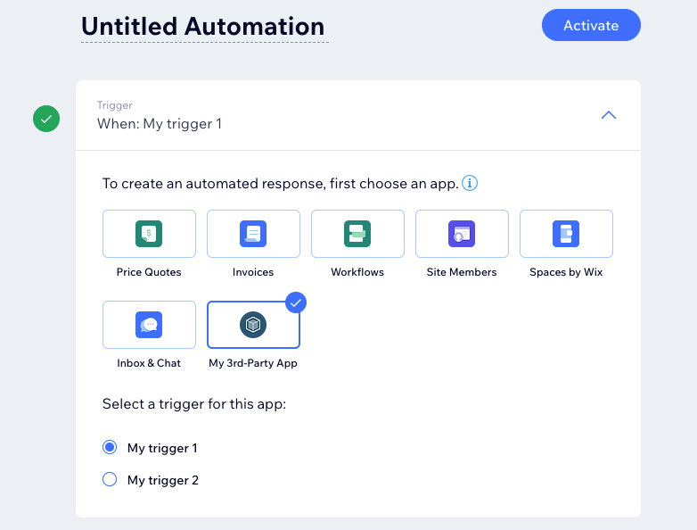

# About Wix Automations

Wix Automations allows site collaborators to automatically take an action
in response to triggers.

Some examples of automations that can be configured are:

* Email a customer a week before an invoice is due.
* Send a chat message when a visitor navigates to a page.
* Notify site collaborators when a visitor submits a form.
* Send Wix Bookings data via webhook to a 3rd-party service when a session is booked.

For more information on how site collaborators can use Wix Automations, see
[Wix Automations: An Overview](https://support.wix.com/en/article/wix-automations-getting-started).

As a trigger provider,
you can integrate events from your own service
to allow site collaborators to create automations with your triggers.
You'll set up your app's trigger in the
[Wix Developers Center](https://dev.wix.com/apps/)
and configure your server to report the relevant events via the
[Triggered Events](https://dev.wix.com/docs/rest/business-management/automations/triggered-events/report-event) API.

## How to become a trigger provider

When configuring your app in the Wix Developers Center,
select **Automations** from the left menu,
then select **Create New > Trigger**.
See [Create Triggers for Your App](https://devforum.wix.com/kb/en/article/create-automation-triggers-for-your-app)
for more information on configuring a trigger.

After users install your app,
your triggers are available for their automations,
as shown here:

## Before you begin

It's important to note these points when planning  your app:

* Your app can provide triggers only.
  Actions and preinstalled automations aren't currently supported for 3rd-party apps.
* Only the app that creates a trigger can report or cancel events for it.
  This means other apps can't use your triggers,
  and you can't use another app's triggers.
* After an event is reported, there isn't a way to get its status.
* Events can't be updated.
  If you need to update a scheduled event,
  you must cancel and then re-report it with the new payload.

## Terminology

* **Automation**: Consists of a trigger and one or more actions.
  Automations are typically created by site collaborators,
  although some automations can come preinstalled.
* **Trigger**: A configuration that defines the business event
  that activates an automation,
  as well as the expected payload schema.
  Triggers are defined per app
  and can be used by site collaborators in their automations.
* **Event**: Activates automations that use a specified trigger.
  Events are reported by providers
  when something happens in the provider's service.
  A reported event contains a payload
  that meets the schema requirements defined by the app that created the trigger.

    An event can be a real-time event or a scheduled event.

    * **Real-time event**: An event that happens at the time it's reported.
    * **Scheduled event**: An event that doesn't happen when it's reported,
      but rather at a future date and time
      as reported in a designated field in the payload.

* **Action**: The result of an automation,
  which happens in response to a trigger.
  A site collaborator can configure an action to happen immediately
  or in relation to a date provided in the trigger's payload,
  depending on how the app configures the trigger.
