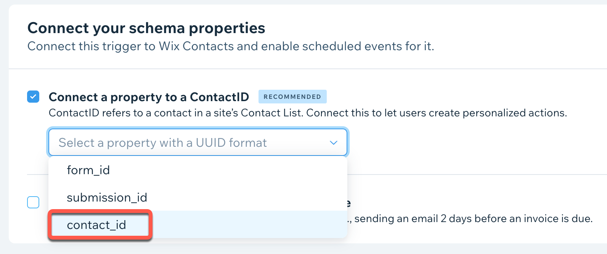
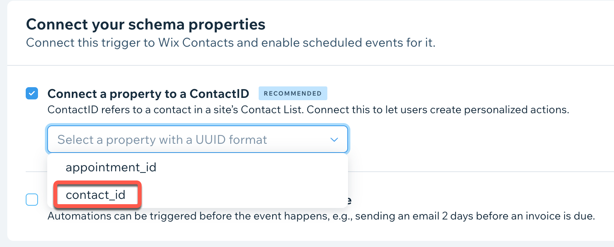
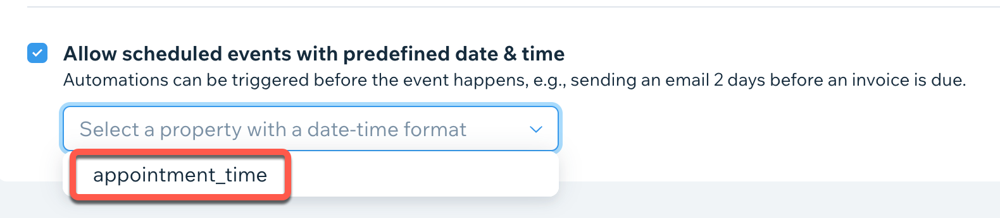

# Sample Flows

This article shares some possible use cases your app could support,
as well as sample flows that could support each use case.
You're not limited to these use cases,
but they can be a helpful jumping off point as you plan your app's implementation.

## Trigger automations when a visitor submits a form from your service

This example shows how you can allow site collaborators to create automations
that are triggered when someone submits a form to your service.

### Trigger configuration prerequisites

When configuring your trigger in the Wix Developers Center,
use these sample settings:

* Set **Trigger name** to "Form submitted"
  and **Trigger key** to "form_submitted".
* Create a [payload schema](https://dev.wix.com/api/rest/wix-automations/triggered-events/the-payload-schema)
  that includes at least a `contact_id` property:

    ```json
    {
      "$schema": "http://json-schema.org/draft-07/schema#",
      "type": "object",
      "required": [
        "contact_id"
      ],
      "properties": {
        "form_id": {
          "title": "Form ID",
          "type": "string",
          "format": "uuid",
          "examples": [
            "ce0683a5-d93a-5ee1-8519-ed7fe9177293"
          ]
        },
        "submission_id": {
          "title": "Submission ID",
          "type": "string",
          "format": "uuid",
          "examples": [
            "5b674360-669d-5ed1-a7fe-2c6dd8838844"
          ]
        },
        "submission_time": {
          "title": "Submission time",
          "type": "string",
          "format": "date-time",
          "examples": [
            "2022-10-27T15:15:39+00:00"
          ]
        },
        "contact_id": {
          "title": "Wix contact ID",
          "type": "string",
          "format": "uuid",
          "examples": [
            "3e884e7f-da65-53dc-ab09-3655e283dd40"
          ]
        },
        "first_name": {
          "title": "First name",
          "type": "string",
          "examples": [
            "Juan"
          ]
        },
        "last_name": {
          "title": "Last name",
          "type": "string",
          "examples": [
            "Dorian"
          ]
        },
        "email": {
          "title": "Email",
          "type": "string",
          "format": "email",
          "examples": [
            "juan.dorian@example.com"
          ]
        },
        "marketing_email_opt_in": {
          "title": "Opted in to marketing emails",
          "type": "boolean",
          "examples": [
            false
          ]
        }
      }
    }
    ```

* In **Connect your schema properties**,
  select **Connect a property to a contactId**,
  then select your **contact_id** payload property
  from the drop-down list:

    

### Report form submission events

Implement this flow to report when a visitor submits the form on your service:

1. When the form is submitted, use
    [Query Contacts](https://dev.wix.com/api/rest/contacts/contacts/contacts-v4/query-contacts)
    (Contacts API) to find a site contact with the submitted `email` value.
    If no results are returned, use
    [Create Contact](https://dev.wix.com/api/rest/contacts/contacts/contacts-v4/create-contact)
    to create a new site contact.
    In both cases, save the returned `contactId`.

2. Construct your payload with the form submission data and metadata,
    and include the returned `contactId` from step 1:

    ```json
    {
      "form_id": "ce0683a5-d93a-5ee1-8519-ed7fe9177293",
      "submission_id": "5b674360-669d-5ed1-a7fe-2c6dd8838844",
      "submission_time": "2022-10-27T15:15:39+00:00",
      "contact_id": "3e884e7f-da65-53dc-ab09-3655e283dd40",
      "first_name": "Juan",
      "last_name": "Dorian",
      "email": "juan.dorian@example.com",
      "marketing_email_opt_in": false
    }
    ```

3. Call [Report Event](https://dev.wix.com/api/rest/wix-automations/triggered-events/report-event)
    with the payload generated in step 2:

    ```json
    {
      "triggerKey": "form_submitted",
      "payload": {
        // Payload generated in step 2
      }
    }
    ```

## Report and cancel scheduled events when a visitor books an appointment from your service

This example shows how you can allow site owners
to create Wix automations based on an appointment's start time,
which is a scheduled event.
It also covers how to cancel the event's remaining actions
if the appointment becomes no longer relevant.

### Trigger configuration prerequisites

For this flow,
you'll set up 2 triggers in the Wix Developers Center
using the settings specified below.
You can use the same payload for both triggers.

**Both triggers: The payload**

For both triggers, create a
[payload schema](https://dev.wix.com/api/rest/wix-automations/triggered-events/the-payload-schema)
that includes at least `contact_id` and `appointment_time` properties:

```json
{
  "$schema": "http://json-schema.org/draft-07/schema#",
  "type": "object",
  "required": [
    "appointment_time",
    "contact_id"
  ],
  "properties": {
    "appointment_id": {
      "title": "Appointment ID",
      "type": "string",
      "format": "uuid",
      "examples": [
        "eeda0937-24c6-56a1-83ea-e58cba67f84c"
      ]
    },
    "appointment_time": {
      "title": "Appointment start time",
      "type": "string",
      "format": "date-time",
      "examples": [
        "2022-10-27T15:15:39+00:00"
      ]
    },
    "appointment_duration_in_mins": {
      "title": "Appointment duration (minutes)",
      "type": "integer",
      "examples": [
        30
      ]
    },
    "contact_id": {
      "title": "Contact ID",
      "type": "string",
      "format": "uuid",
      "examples": [
        "7d8253a8-4768-5872-8b32-65d5efc982a4"
      ]
    },
    "email": {
      "title": "Email",
      "type": "string",
      "format": "email",
      "examples": [
        "juan.dorian@example.com"
      ]
    },
    "first_name": {
      "title": "First name",
      "type": "string",
      "examples": [
        "Juan"
      ]
    },
    "last_name": {
      "title": "Last name",
      "type": "string",
      "examples": [
        "Dorian"
      ]
    }
  }
}
```

**Trigger 1: Appointment booked**

* Set **Trigger name** to "Appointment booked"
  and **Trigger key** to "appointment_booked".

* Use the payload schema from above.

* In **Connect your schema properties**,
  select **Connect a property to a contactId**,
  then select your **contact_id** payload property from the drop-down list.

    

**Trigger 2: Appointment started**

* Set **Trigger name** to "Appointment started"
  and **Trigger key** to "appointment_started".

* Use the payload schema from above.

* In **Connect your schema properties**, use these settings:

  * Select **Connect a property to a contactId**,
    then select your **contact_id** payload property from the drop-down list.

      

  * Select **Allow scheduled events with predefined date & time**,
    then select your **appointment_time** payload property from the drop-down list.

      

### Handle appointment scheduling and cancellation events

1. When the form is submitted, use
    [Query Contacts](https://dev.wix.com/api/rest/contacts/contacts/contacts-v4/query-contacts)
    (Contacts API) to find a site contact with the submitted `email` value.
    If no results are returned, use
    [Create Contact](https://dev.wix.com/api/rest/contacts/contacts/contacts-v4/create-contact)
    to create a new site contact.
    In both cases, save the returned `contactId`.

2. Generate an `appointment_id` in UUID format,
    and store it in your database.
    This ID is required if you need to cancel the event.

3. Construct your payload with the appointment data.
    Include the returned `contactId` from step 1
    and the generated `appointment_id` from step 2:

    ```json
    {
      "appointment_id": "eeda0937-24c6-56a1-83ea-e58cba67f84c",
      "appointment_time": "2022-10-27T15:15:39+00:00",
      "appointment_duration_in_mins": 30,
      "contact_id": "7d8253a8-4768-5872-8b32-65d5efc982a4",
      "email": "juan.dorian@example.com",
      "first_name": "Juan",
      "last_name": "Dorian"
    }
    ```

4. Call [Report Event](https://dev.wix.com/api/rest/wix-automations/triggered-events/report-event)
    for each trigger with the payload generated in step 3.
    Set `externalEntityId` to the `appointment_id` generated in step 2.
    This will allow your app to cancel any pending events in your user's automations
    if the appointment is canceled:

    **Report event for trigger 1: Appointment booked**

    ```json
    {
      "triggerKey": "appointment_booked",
      "externalEntityId": "eeda0937-24c6-56a1-83ea-e58cba67f84c",
      "payload": {
        // Payload generated from step 3
      }
    }
    ```

    **Report event for trigger 2: Appointment started**

    ```json
    {
      "triggerKey": "appointment_started",
      "externalEntityId": "eeda0937-24c6-56a1-83ea-e58cba67f84c",
      "payload": {
        // Payload generated from step 3
      }
    }
    ```

5. If the appointment is canceled before the start time, call
    [Cancel Event](https://dev.wix.com/api/rest/wix-automations/triggered-events/cancel-event)
    for each trigger.
    Set `externalEntityId` to the `appointment_id` generated in step 2,
    which you should have stored in your database.

    **Cancel event for trigger 1: Appointment booked**

    ```json
    {
      "triggerKey": "appointment_booked",
      "externalEntityId": "eeda0937-24c6-56a1-83ea-e58cba67f84c"
    }
    ```

    **Cancel event for trigger 2: Appointment started**

    ```json
    {
      "triggerKey": "appointment_started",
      "externalEntityId": "eeda0937-24c6-56a1-83ea-e58cba67f84c"
    }
    ```
