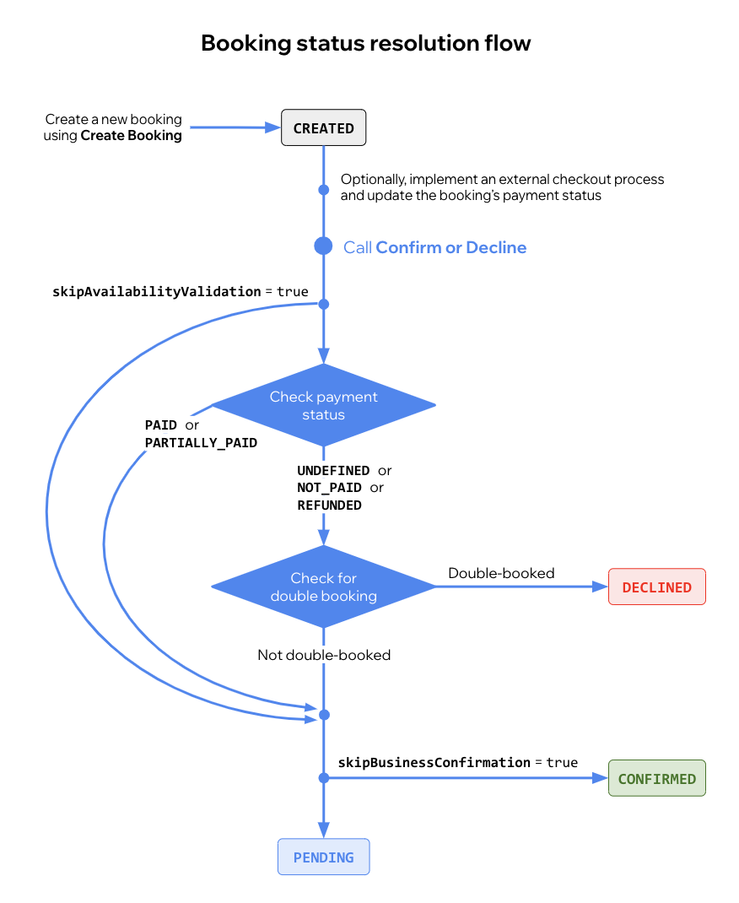

# Wix Bookings Lifecycle

Managing bookings with Wix is a process tracked through various stages using a lifecycle status. 
This status is instrumental in controlling potential actions, such as confirming a pending booking, and ensures a smooth transition of the booking from start to finish.

Below is a brief outline of possible booking statuses:

- `CREATED`: This is the initial status of a booking, indicating creation but not yet visibility on the business calendar. 
    + It can be used for checkout or undergo separate processing. To create a booking, use [Create Booking](https://dev.wix.com/api/rest/wix-bookings/bookings-v2/create-booking).

- `CONFIRMED`: The approval of the booking by the site owner is indicated by this status, and it becomes visible on the business calendar. 
    + You can manually switch a booking from `PENDING` to `CONFIRMED` using [Confirm Booking](https://dev.wix.com/api/rest/wix-bookings/bookings-v2/confirm-booking). 
    + A booking can auto-confirm when the [service](https://dev.wix.com/api/rest/wix-bookings/services/service/create-service) is set to do so 
    + A booking can also auto-confirm when the eCommerce order gets approved (coming soon)
    

- `PENDING`: This status denotes that the booking awaits confirmation or declination by the owner and is visible on the business calendar. 
    + The system automatically assigns this status when a related eCommerce order is created.

- `WAITING_LIST`: This status implies that the booking is on a waiting list. 
    + To create such bookings, you need to use the [Waitlist APIs](https://dev.wix.com/api/rest/wix-bookings/waitlist/introduction). 

- `DECLINED`: This status indicates the site owner's rejection of the booking. 
    + You can manually decline a booking using [Decline Booking](https://dev.wix.com/api/rest/wix-bookings/bookings-v2/decline-booking). 
    + The system automatically declines bookings when an associated eCommerce order is declined.  
    + The system also declines double bookings for free bookings..

- `CANCELED`: This status arises when the site owner or the customer cancels the booking. 
    + To cancel a booking, use [Cancel Booking](https://dev.wix.com/api/rest/wix-bookings/bookings-v2/cancel-booking).

Bookings can be confirmed with or without payment, but there are a few details to keep in mind:
- Payment ensures confirmation, even under `DOUBLEBOOKING`.
- [Confirm or Decline](https://dev.wix.com/api/rest/wix-bookings/confirmation/confirm-or-decline-booking) validates bookings, checking for availability and business confirmation.
- `DOUBLEBOOKING` is also permissible without payment by setting `skipAvailability` as `true` at booking creation.

The diagram below showcases the status transitions throughout the booking life cycle:

The flow of a booking can be changed with `flowControlSettings`:
- A booking will auto-confirm and not go to pending if it was defined to skip business confirmation.
- A booking will never be a double booking is the availability check is skipped.
Learn more about `flowControlSettings`(#createBooking)